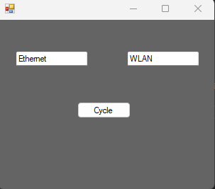

### How I somewhat got around my shitty DSL download speeds

Recently I reset my computer because it was unbearibly slow from time to time. I wiped all my harddrives and re-installed Windows 11. When I re-installed the first game from my Steam library, Baldur's Gate 3 which clocks in at around 150 GB download size, it hit me: my internet sucks. With a measly 70 Mbps download, it would take me almost 5 hours to download the game and that is just one of the many games I wanted to install.

Then I rembered: wait, I have unlimited celluar data. I can download as much as I like and 4G is way faster than the 70 Mbps I'm getting via DSL! So I did a speed test that clocked in at 205 Mbps. That's an increase of ~193%, now Baldur's Gate just takes a little over 1,5 hours to download. 
So I connected my PC to my phone's hotspot, and resumed the download. Speeds were looking good, the estimated time looked correct and so I left my computer alone to make some food.

I was done eating, came back to my PC, happy to play some Baldur's Gate aaaaand... it was still downloading with around 70 Mbps. Huh? Did it loose connection and resume via Ethernet? I checked on my phone and nope, my PC still was connected. Next I checked in the Windows settings. No traffic on the Ethernet network adapter, everything ran on the wifi adapter. Some googling later and I found a forum's post of someone complaining about the provider limiting download speed drasticly after some time when downloading large amounts of data. 
So I tried turning off Wifi, waited for about two minutes, turning it back on, connecting to my phone and resume the download. My thought process being that maybe the provider would only limit for a "sustained current of data", for the lack of a better word, and it actually worked. The download resumed just as fast as before I got limited.

Because I only got full speed for about 10 to 15 minutes, the process of turning off the Wifi, waiting, turning it on and reconnecting got very annoying very quickly, I tried to find ways of achieving the same with less "work". Soon I found out that I can just deactivate the Wifi adapter in Windows setting. It will then continue on Ethernet and when I want to try Wifi again, I just need to deactivate Ethernet and re-activate Wifi. It will re-connect automatically to the hotspot and resume the download on cellular data. That got way too cumbersome aswell, and I thought of a way to do it automatically.

My first idea was to ask ChatGPT what the best language is to do native Windows programming. It thought of C# to be a good choice, so I enquired about some code that lets me cut off internet access on Windows 11, as I never even wrote a single line of C# in my life, and wanted to jump in head first without learning the basics. What it generated was surprisingly way less code than I expected:

```c#
using System;
using System.Management;

class Program
{
    static void Main(string[] args)
    {
        // Find the network adapter corresponding to internet connection
        string adapterName = "Your Network Adapter Name"; // Change this to your network adapter name

        // Disable internet access by disabling the network adapter
        DisableNetworkAdapter(adapterName);

        Console.WriteLine("Internet access has been disabled.");
    }

    static void DisableNetworkAdapter(string adapterName)
    {
        ManagementObjectSearcher searcher = new ManagementObjectSearcher("SELECT * FROM Win32_NetworkAdapter WHERE NetConnectionId != NULL");
        foreach (ManagementObject networkAdapter in searcher.Get())
        {
            string name = networkAdapter["NetConnectionId"] as string;
            if (name != null && name.Equals(adapterName, StringComparison.OrdinalIgnoreCase))
            {
                networkAdapter.InvokeMethod("Disable", null);
                break;
            }
        }
    }
}

```
The prompt being
> Using C#, how could I "cut off" internet access on Windows 11?

The code snipped actually compiled and worked first try, what was a first for me with ChatGPT code generation. Usually it doens't really get what I want it to do or there's some other issue. Or maybe just my prompts suck, I don't know ¯\\_(ツ)\_/¯.

Going on, I wanted to have some sort of GUI where I could just press a button to toggle the network adapter.

Prompting
> Add a very simple GUI to it. Make an input field where the user can enter the network adapter name and a button that calls the DisableNetworkAdapter method

I got

```c#
using System;
using System.Management;
using System.Windows.Forms;

class Program
{
    static void Main(string[] args)
    {
        Application.EnableVisualStyles();
        Application.SetCompatibleTextRenderingDefault(false);
        Application.Run(new MainForm());
    }

    public class MainForm : Form
    {
        private TextBox adapterNameTextBox;
        private Button disableButton;

        public MainForm()
        {
            InitializeComponent();
        }

        private void InitializeComponent()
        {
            this.adapterNameTextBox = new TextBox();
            this.disableButton = new Button();
            this.SuspendLayout();
            
            // configuration of UI elements is not important in this example
            this.disableButton.Click += new System.EventHandler(this.disableButton_Click);
            // more configuration

            this.ResumeLayout(false);
            this.PerformLayout();
        }

        private void disableButton_Click(object sender, EventArgs e)
        {
            string adapterName = adapterNameTextBox.Text;
            DisableNetworkAdapter(adapterName);
            MessageBox.Show("Internet access has been disabled for the specified adapter.");
        }
    }

    static void DisableNetworkAdapter(string adapterName)
    {
        ManagementObjectSearcher searcher = new ManagementObjectSearcher("SELECT * FROM Win32_NetworkAdapter WHERE NetConnectionId != NULL");
        foreach (ManagementObject networkAdapter in searcher.Get())
        {
            string name = networkAdapter["NetConnectionId"] as string;
            if (name != null && name.Equals(adapterName, StringComparison.OrdinalIgnoreCase))
            {
                networkAdapter.InvokeMethod("Disable", null);
                return;
            }
        }
        MessageBox.Show("Failed to find the specified network adapter.");
    }
}

```

Some trouble shooting because of missing references and the re-creation of the project, this time as a Windows Forms project, later, the code compiled. Because the rest is not very interesting and this post is already long enough, here's the any% speedrun:

I
- added another textfield, as I need to cycle between two different adapters. I could have hardcoded the adapter names, but I wanted it somewhat generic if something about my network setup changes
- implemented some basic logic to always disable B when A is active and vice versa
- added some cleanup code to re-anable all adapters when closing the application

This is what I ended up with:



You can view the full code on [GitHub](https://github.com/CodeF0x/NAC).

While not solving some difficult problem or building something impressive or inherently useful, I got to play around with C# and Windows development, something I've never done before. I even got a little better at writing AI prompts. That will be important later when the job of the Software Engineer fully transformed to Prompt Engineer 😉.
But most importantly, I don't clog up my entire bandwidth for hours because I want to drive around in a virtual car for 30 minutes before going to bed.

Thanks for coming to my TED talk.